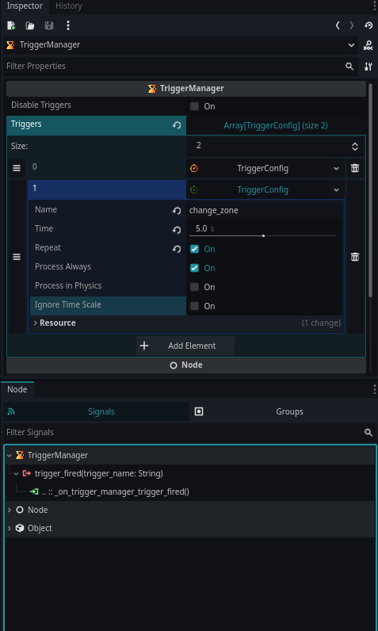

# Trigger Manager

<div style="width:100%; display:flex;align-items:center; justify-content:center;">

</div>

Trigger Manager is a Godot plugin that allows you to create and manage
timed triggers directly from the Inspector.\
Each trigger internally uses `SceneTreeTimer` to fire events at the
configured time and emits a signal with the trigger's name.

Ideal for sequences, cutscenes, gameplay logic, automation systems, and
any situation where timed events are needed in a clean and centralized
way.

---

## Features

- Configure multiple triggers directly in the Inspector
- Each trigger fires once or repeats (loop mode)
- Emits a `trigger_fired(trigger_name: String)` signal
- Support for custom processing modes
- Add and remove triggers dynamically via code
- Provides configuration warnings for missing or duplicate names
- Easy to integrate with any gameplay system

---

## Getting Started

### 1. Enable the plugin

Place the plugin folder inside:

    res://addons/trigger_manager/

Then enable it in:

    Project > Project Settings > Plugins

---

## Signals

```gdscript
signal trigger_fired(trigger_name: String)
```

Fired whenever a trigger completes its timer.

---

## Example Usage

### Listening to Trigger Events

```gdscript
extends Node

@onready var trigger_manager: TriggerManager = $TriggerManager

func _ready() -> void:
    trigger_manager.trigger_fired.connect(_on_trigger_fired)

func _on_trigger_fired(name: String) -> void:
    print("Trigger fired:", name)
```

---

## Adding Triggers via Code

```gdscript
trigger_manager.add_trigger("enemy_spawn", 3.0, false)
trigger_manager.add_trigger("loop_event", 1.5, true)
```

If a trigger with the same name already exists, a warning is shown and
it will not be added.

---

## Removing Triggers via Code

```gdscript
trigger_manager.remove_trigger("enemy_spawn")
trigger_manager.remove_trigger("loop_event")
```

If a trigger does not exist, a warning is shown.

---

## Inspector Setup

In the Inspector, you can configure:

- Trigger name
- Timeout duration
- Repeat mode
- Processing mode (idle, physics, always)
- Ignore time scale

Each TriggerConfig resource is initialized automatically on startup.

---

## Configuration Warnings

Trigger Manager will warn you if:

- A trigger has no name
- Two triggers share the same name
- A trigger is empty/unconfigured

These warnings appear directly in the Inspector.

---

## Public API Summary

### Add Trigger

```gdscript
func add_trigger(trigger_name: String, time: float, repeat: bool) -> void
```

### Remove Trigger

```gdscript
func remove_trigger(trigger_name: String) -> void
```

### Access Triggers

```gdscript
var list: Array[TriggerConfig] = trigger_manager.triggers
```

### Disable All Triggers

```gdscript
trigger_manager.disable_triggers = true
```

---

## Screenshots

**Screenshot InputManager**



---

## ❤️ Support

If this project helps you, consider supporting:
https://github.com/sponsors/Saulo-de-Souza
